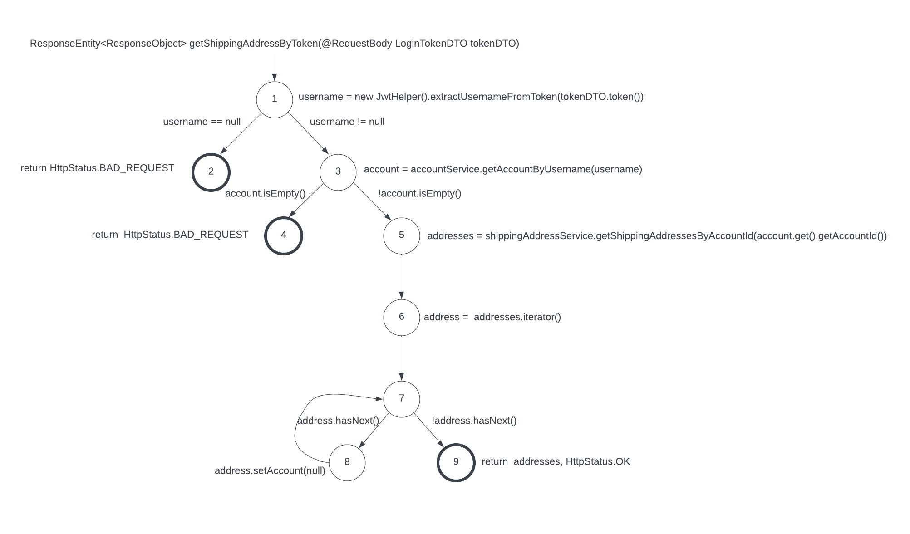
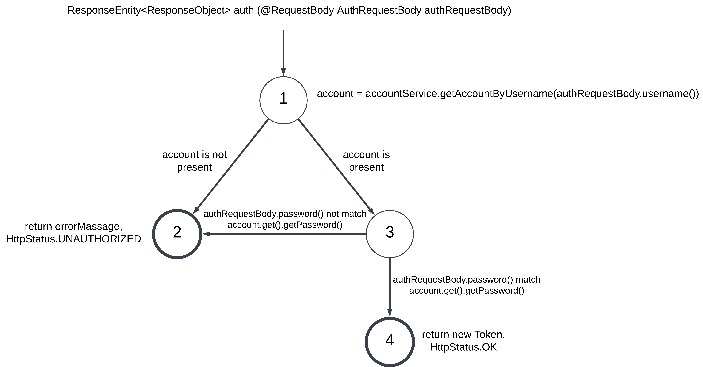
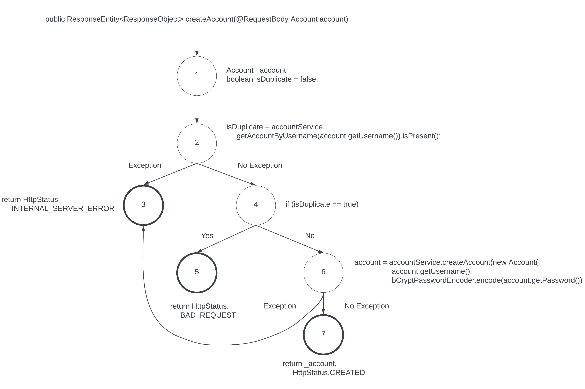

# Buildup

## Project Overview

The project centers around a web application designed for the purchase and sale of fashion items, 
with a specific emphasis on shoes and shirts. It is developed using React and Spring Boot, incorporating MySQL for database functionality. 
The testing phase encompasses unit testing with JUnit and the automation of UI testing using the Robot framework.

## Collaborators

- Thanawat Kanjanapoo ([GitHub](https://github.com/sRubyy))
- Kaewalin Limpremwattana
- Punnavich Thanormvongse ([GitHub](https://github.com/Lemonnn11))
- Poomrapee Wareeboutr (Me)
- Thanakorn Charoenritthitham ([GitHub](https://github.com/tnktian))
- Supawit Phimonjit ([GitHub](https://github.com/Twans99))
- Sutthiphon Thankam

## Run a Demo

We containerize our application using Docker. Thus, you can effortlessly run this application anywhere by following the instructions below.

1. Install and open [Docker Desktop](https://www.docker.com/products/docker-desktop/).
2. Clone this repository.
3. Open a terminal and enter this command `docker compose up`.
4. Wait until container initialization is finished.
5. The Application will be running at http://localhost:3000/.
6. Type this command in a terminal `docker compose down -v` for terminating.

*Note: It may take some time to initialize services (API) for the application since it has to wait until the MySQL container completes its setup...*

## Application Preview

## Unit Testing Design (3 examples)

### Function: `ShippingAddressController.findShippingAddressByToken(@RequestBody LoginTokenDTO tokenDTO)`

#### Testing Goal

The testing aims to verify that the controller API works as intended by specifying a user token. it should find the addresses of the user then return addresses and OK status. 
If the user token is not found, it should return BAD REQUEST status.

#### Control Flow Graph (CFG)

#### Test Requirements (Prime Path Coverage)

| Prime Paths   | Covered By |
|---------------|------------|
| [1,2]         | T1         |
| [1,3,4]       | T3         |   
| [8,7,8]       | T2         |
| [8,7,9]       | T2         |
| [7,8,7]       | T2         |
| [1,3,5,6,7,8] | T2         |
| [1,3,5,6,7,9] | T4         |

#### Implement Test Paths

|    | Test Paths            | Test Case Values                              | Expected Values          |
|----|-----------------------|-----------------------------------------------|--------------------------|
| T1 | [1,2]                 | `token: null`                                 | HttpStatus.BAD_REQUEST   |
| T2 | [1,3,4]               | `token: '${nonExistingAccountToken}'`         | HttpStatus.BAD_REQUEST   |
| T3 | [1,3,5,6,7,8,7,8,7,9] | `token: '${existingAccount}' (has addresses)` | Addresses, HttpStatus.OK |
| T4 | [1,3,5,6,7,9]         | `token: '${existingAccount}' (no address)`    | Addresses, HttpStatus.OK |

### Function: `AuthenticationController.auth(@RequestBody AuthRequestBody authRequestBody)`

#### Testing Goal

The testing aims to verify that the controller sign-in API works as intended by specifying `username` and `password`. 
it should return a new `user Token` and OK status if the authentication is successful otherwise it should return a UNAUTHORIZED status with an error message.

#### Control Flow Graph (CFG)

#### Test Requirements (Prime Path Coverage)

| Prime Path | Covered By |
|------------|------------|
| [1,2]      | T1         |
| [1,3,2]    | T2         |
| [1,3,4]    | T3         |

#### Implement Test Paths

|    | Test Path | Test Case Values                                                   | Expected Values                       |
|----|-----------|--------------------------------------------------------------------|---------------------------------------|
| T1 | [1,2]     | `username: '${wrongUsername}'`, `password: '${wrongPassword}'`     | ErrorMessage, HttpStatus.UNAUTHORIZED |
| T2 | [1,3,2]   | `username: '${correctUsername}'`, `password: '${wrongPassword}'`   | ErrorMessage, HttpStatus.UNAUTHORIZED |
| T3 | [1,3,4]   | `username: '${correctUsername}'`, `password: '${correctPassword}'` | Token, HttpStatus.OK                  |

### Function: `AuthenticationController.createAccount(@RequestBody Account account)`

#### Testing Goal

The testing aims to verify that the controller register API works correctly by specifying the input for the registration process.
It should return CREATED status if the `username` is not duplicated on the database otherwise return BAD_REQUEST status.
Also, the API should return INTERNAL_SERVER_ERROR status if the exception occurs.

#### Control Flow Graph (CFG)

#### Test Requirements (Prime Path Coverage)

| Prime Path  | Covered by |
|-------------|------------|
| [1,2,4,6,3] | T1         |
| [1,2,4,6,7] | T2         |
| [1,2,4,5]   | T3         |
| [1,2,3]     | T4         |

#### Implement Test Paths

|    | Test Paths  | Test Case Values                                                   | Expected Values                  |
|----|-------------|--------------------------------------------------------------------|----------------------------------|
| T1 | [1,2,4,6,3] | `username: '${nonExistingUsername}'`, `password: '${anyPassword}'` | HttpStatus.INTERNAL_SERVER_ERROR |
| T2 | [1,2,4,6,7] | `username: '${nonExistingUsername}'`, `password: '${anyPassword}'` | HttpStatus.CREATED               |
| T3 | [1,2,4,5]   | `username: '${existingUsername}'`, `password: '${anyPassword}'`    | HttpStatus.BAD_REQUEST           |
| T4 | [1,2,3]     | `username: '${anyUsername}'`, `password: '${anyPassword}'`         | HttpStatus.INTERNAL_SERVER_ERROR |

### Execute Unit Tests

To run all automated unit tests, use the Gradle test task (alternatively, change the directory to `build-up-backend` and use `./gradlew test`), 
the task will run all test which located in `build-up-backend/src/test/java/com/gemini11/buildupbackend`.

## System Testing

In system testing, we decided on test cases to check whether our system meets the specified requirements (User story) or not. 
We also do the Requirement Traceability Matrix (RTM) to match our requirements for each test case. 
Our test case has covered the user story as shown below.

- User login to the system.
- User sign up to the system.
- User logout from the system.
- Seller adds fashion product.
- Seller edits fashion product.
- Seller deletes fashion product.
- Buyer adds product to cart.
- Buyer deletes product from cart.
- Buyer edits product in cart.
- Buyer makes payment with credit card.
- Buyer checks out the product.
- Buyer makes payment with online banking.
- User searches product by name.
- User searches product by category.
- Buyer checks buying history.

The test case and RTM are located in `manual-test-cases` folder.

## Automated UI Testing

In automated testing, we used Robot Framework and Selenium library to write the test script of test cases that we decided at the system testing part. 
User stories that we did the automation testing are listed below.

- User login to the system.
- Buyer makes payment with a credit card.
- Buyer makes payment with online banking.
- User searches product by name.
- User searches products by category.

### Install Robot Framework and Selenium Library (Required)

1. The Robot framework is built on Python. So, ensure you have Python installed on your machine. Try opening the command line and execute the command `python3 --version` or `pip3 --version`.
2. If you cannot see the Python version, install [Python](https://www.python.org/downloads/).
3. Then install Robot framework and Selenium library using this command in the command line `pip3 install robotframework robotframework-seleniumlibrary`.

After you install all of these things, you can start to execute the automated test script that is located in the `automated-test-cases/test-script` folder.

### Execute Automated UI Tests

Change directory to `automated-test-cases/test-script` and execute a single test module using this command in your terminal `robot <file.robot>`. 
